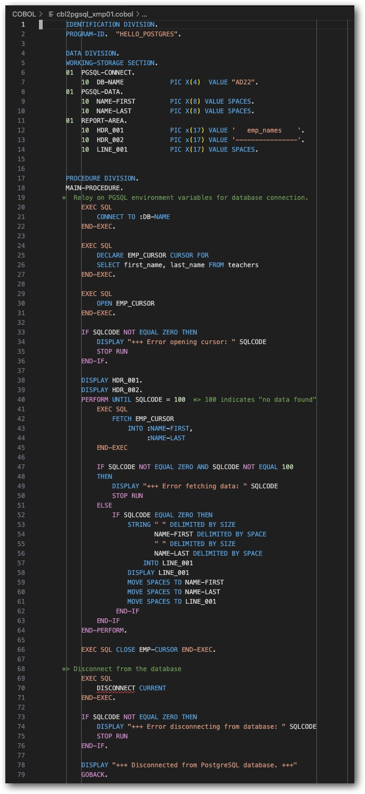

## IBM COBOL for Linux on x86 verion 1.2.0.6, April 2025, [integrates with PostgreSQL](https://www.postgresql.org/about/news/new-postgresql-support-in-ibm-cobol-for-linux-on-x86-3074/).

>  IBM COBOL for Linux on x86 1.2 integrates with PostgreSQL through SQL statements embedded in COBOL programs that enable you to retrieve, update, insert, and delete data from a PostgreSQL database. This integration provides a PostgreSQL coprocessor instead of a preprocessor, which means that the compiler translates the EXEC SQL statements into COBOL statements during the compilation process itself, rather than during a separate step before compilation. The COBOL for Linux coprocessor for PostgreSQL is based on the PostgreSQL ECPG preprocessor, modified to support COBOL instead of C. The coprocessor is integrated into the COBOL compiler. When a COBOL program with embedded SQL statements runs, it uses the same library that the ECPG preprocessor uses to run a C program.


<p>
In a wide-ranging discussion about technology, a friend and I discussed this development.  Our conversation motivated me to create the content in this repository.
</p>

With the PostgreSQL command line tool pgsl a database query can be expressed as:
```
'psql --dbname AD22 --command "SELECT CONCAT(first_name, ' ', last_name) AS emp_names FROM teachers;"'
```
Resulting in:
```
   emp_names
----------------
 Janet Smith
 Lee Reynolds
 Samuel Cole
 Samantha Bush
 Betty Diaz
 Kathleen Roush
(6 rows)
```

For organizations with COBOL investments, PostgreSQL provides a database option for
*  development and training environments
*  prototyping application changes 
*  replicating production problems in a low risk environment

One line of the PostgreSQL command line tool provides the result above.  The same result in COBOL takes significantly more code.  The advantage is that PostgreSQL is now an option for your COBOL environment.



AI stories are dominating business and technology news.  Yet, to accomplish the results in this repo a person:
*  needs to fill in the gaps of what AI chatbots 
*  shift through paritial correct chatbot responses 
*  bring clarity to the ambiguous with experimentation
*  observe what is working, and what is not working, articulate the difference, then create a plan of action
*  write code, test the code and determine how it may be improved
*  work through the organizaton process to incorporate the code into a production system

This example illustrates that people enable the value of a technology system.  The pieces do not assemble themselves.

If your interest is experimenting with IBM COBOL and PostgreSQL, this worked example will save you several hours.

### Sample program compilation and execution.

Note: the development work and the PostgreSQL instance are running on an Apple Silicon Mac.  An Apple Intel Mac with Broadcom VMWare Fusion host a RHEL 9 instance.  sftp and ssh are used for the remote connection.
~~~zsh
% ./compile-run.sh cbl2pgsql_xmp01

***  2025-08-06T11:37:45:-0500 --  001  Compile and execute cbl2pgsql_xmp01 on the remote RHEL machine.  ***
------------------------------------------------------------------------------------------------------------
>>>sftp ic4lx86:/home/virtuser/COBOL <<< "put ../COBOL/cbl2pgsql_xmp01.cobol"<<<

Connected to ic4lx86.
Changing to: /home/virtuser/COBOL
sftp> put ../COBOL/cbl2pgsql_xmp01.cobol
Uploading ../COBOL/cbl2pgsql_xmp01.cobol to /home/virtuser/COBOL/cbl2pgsql_xmp01.cobol
cbl2pgsql_xmp01.cobol                                                                                                             100% 2621    27.1KB/s   00:00    

***  2025-08-06T11:37:46:-0500 --  002  Compile and link-edit to PGSQL ecpg.  ***
---------------------------------------------------------------------------------
>>>ssh ic4lx86 cob2_pgsql /home/virtuser/COBOL/cbl2pgsql_xmp01.cobol -o cbl2pgsql_xmp01<<<

End of compilation 1,  program HELLO_POSTGRES,  no statements flagged.
IBM COBOL for Linux 1.2.0 compile started

***  2025-08-06T11:37:46:-0500 --  003  Execute the COBOL program to display results from PGSQL.  ***
-----------------------------------------------------------------------------------------------------
>>>ssh ic4lx86 ./cbl2pgsql_xmp01<<<

   emp_names     
---------------- 
 Janet Smith     
 Lee Reynolds    
 Samuel Cole     
 Samantha Bush   
 Betty Diaz      
 Kathleen Roush  
+++ Disconnected from PostgreSQL database. +++

***  2025-08-06T11:37:47:-0500 --  004  Validate the COBOL PGSQL results with psql expression equivalent to the COBOL program.  ***
-----------------------------------------------------------------------------------------------------------------------------------
>>>psql --dbname AD22 --command "SELECT CONCAT(first_name, ' ', last_name) AS emp_names FROM teachers;"<<<

   emp_names    
----------------
 Janet Smith
 Lee Reynolds
 Samuel Cole
 Samantha Bush
 Betty Diaz
 Kathleen Roush
(6 rows)
~~~